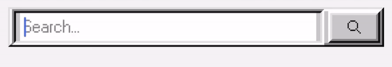

# react native windows95 search bar

🔍 a **windows95 inspired** search bar component

🕹️ designed to be used in Windows-95/early internet inspired retro UIs. 

💾 seamlessly **integrate your API** if desired by using the query, onChange and onSubmit props

🛠️ uses components from the **react95-native** library, so don't forget to install it (see usage)

---

## 💽 demo



---

## 💽 highlights

⭐️ **supports API integration** 

⭐️ **customizable placeholder** 

⭐️ **lightweight and dependency-free**, reliant on react native and react95-native

---

## 💽 installation

```bash
npm install github:chloechartrand/react-native-windows95-searchbar
# or
yarn add github:chloechartrand/react-native-windows95-searchbar
```

**make sure you install react95-native**

```bash
npm install react95-native
# or
yarn add react95-native
```

---

## 💽 usage 

💾 **props** 

| Prop         | Type                     | Default             | Description                                           |
|--------------|--------------------------|-------------------|-------------------------------------------------------|
| `query`      | `string`                 | `""`               | Current text input value.                             |
| `onChange`   | `(text: string) => void` | required           | Fired when input changes.                             |
| `onSubmit`   | `() => void`             | required           | Fired when user submits search (press enter or button). |
| `placeholder`| `string`                 | `"placeholder..."` | Optional placeholder text.                            |


👾 **example with states** 

```tsx
import React, { useState } from 'react';
import { View } from 'react-native';
import SearchBar95 from 'react-native-windows95-searchbar';

export default function App() {
  const [query, setQuery] = useState('');

  return (
    <View style={{ padding: 20 }}>
      <SearchBar95
        query={query}
        onChange={setQuery}
        onSubmit={() => console.log('Search submitted:', query)}
        placeholder="Search users..."
      />
    </View>
  );
}
```

---
